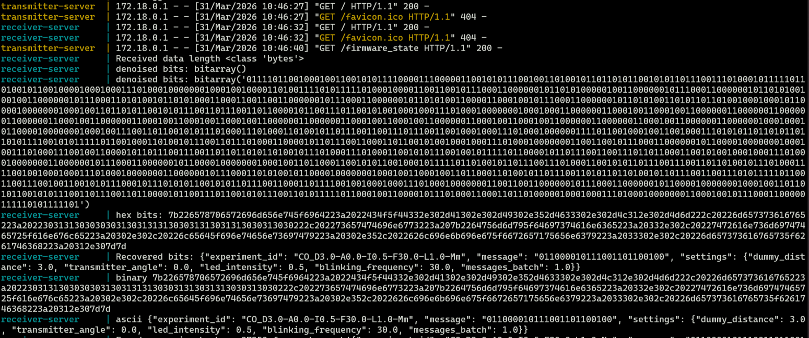

# Dummies Server
This repository contains the backend infrastructure for the **TEIDESAT Optical Communications test environment**. It acts as a distributed HTTP bridge connecting the user interface (`dummies-gui`) with the physical microcontrollers (`dummies-firmware`).

## Architecture

The system follows a microservices architecture built with **Flask**, divided into two main independent servers:

### Transmitter server
Acts as the **"boss"** for the transmitting ESP32. 
- Receives the experiment parameters (message, frequency, distance) from the GUI via HTTP POST.
- Persists each instruction in a CSV file (`transmitter/data/transmitter_data.csv` by default). The physical ESP32 continuously polls this server (`GET /firmware_state`) to know when to start transmitting light pulses.

### Receiver server
Acts as the **data aggregator** for the receiving ESP32.
- Receives the raw, noisy binary stream of light pulses from the ESP32.
- Parses the binary stream, searching for the official headers (`TEIDESAT`) and tails (`TASEDIET`), and applies noise reduction.
- Groups the decoded messages into `Experiment` objects and queues them in a buffer for the GUI to fetch.
- Stores the latest received payloads in CSV (`receiver/data/receiver_data.csv` by default) for lightweight traceability during tests.

### Firmware Emulator
Located in [receiver/firmware-emulator/](receiver/firmware-emulator/firmware-emulator.py), this CLI tool is used for **software testing** when the physical ESP32 boards are **unavailable**. It generates fake optical packages, injects intentional noise/bit-flips, and sends them to the receiver server to validate the decoding algorithms.

## Environment configuration

Runtime settings (debug mode, host names, ports, firmware endpoints, etc.) are injected through a local `.env` file. To prepare a new environment:

1. Copy the template: `cp .env.example .env`.
2. Edit `.env` and provide real values for:
	- `DEBUG_MODE`
	- `TRANSMITTER_SERVER_HOST` / `TRANSMITTER_SERVER_PORT`
	- `RECEIVER_SERVER_HOST` / `RECEIVER_SERVER_PORT`
3. Launch the services with `./launch-transmitter.sh --build` or `./launch-receiver.sh --build`. Docker Compose automatically loads `.env` via the `env_file` directive.

Never commit the populated `.env`; it contains deployment-specific data. If a secret leaks into the repository, remove it with `git rm --cached .env`, rotate the credentials, and rebuild the containers.


## Testing the server
To test the backend or the emulator, the servers must be running first. Also, don't forget to prepare the .env.

### 1. Docker
Open a terminal in the root directory and start the containers. Leave this terminal running in the background so you can monitor the application logs. If you're using **WSL**, dont forget to open your Docker Desktop app.

```bash
docker compose up --build
```

### 2. Browser check
While Docker is running, open a web browser and navigate to the root endpoints to verify both servers are active:

- **Transmitter:** [http://localhost:5000](http://localhost:5000) (Should say `"Hello world from the transmitter server!"`)
- **Receiver:** [http://localhost:5001](http://localhost:5001) (Should say `"Hello world from the receiver server!"`)

### 3. Check the transmitter state
The physical ESP32 continuously polls the backend to determine its operational state. This state can be verified manually:

- Go to: [http://localhost:5000/firmware_state](http://localhost:5000/firmware_state) (It should return **`Idle`**. When an experiment actually starts, this will change to **`Sending`**)

### 4. Hardware simulation
If physical microcontrollers are unavailable, the included **Python emulator** can be used. It simulates the receiving ESP32 by reading a JSON payload, converting it into a raw binary stream with the `TEIDESAT` and `TASEDIET` headers, and sending it to the Receiver Server.

- **Note:** Ensure the Docker containers from step 1 are actively running before proceeding, otherwise the connection will be refused.

Open a new, separate terminal and activate your Python virtual environment and install the dependencies:

```Bash
source venv/bin/activate  	# On Windows: .\venv\Scripts\activate
pip install -r requirements.txt
```

Navigate to the emulator directory and execute the script:

```Bash
cd receiver/firmware-emulator
python3 firmware-emulator.py
```

In the interactive menu, select option 1 to load a sample message:

```Plaintext
Select your option: 1
Write the path to the message to add: messages/message-sample.json
```

Select option 4 to send the simulated optical packages to the server:

```Plaintext
Select your option: 4
Sending packages...
48 packages to send
```

**Verify the reception:** Switch back to your first terminal (the one running Docker). The receiver-server logs will display the incoming binary stream being processed, denoised, and successfully extracted into a JSON experiment.

